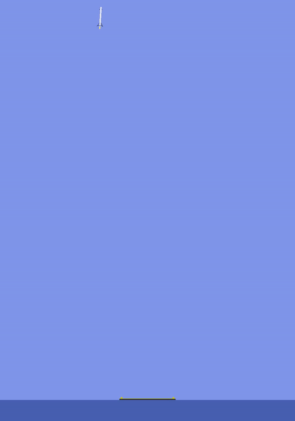

# Landing-a-SpaceX-Falcon-heavy-using-Proximal-Policy-Optimization-
Let us try to land a SpaceX Falcon Heavy Rocket in simulation using Reinforcement learning. Reinforcement learning is a technique that lets an agent learn how best to act in an environment using rewards as its signal. OpenAI released a library called Gym that lets us train AI agents really easily. We'll also use Stable Baselines and gym libraries to build an RL agent capable of landing a rocket perfectly. The specific algorithm we will be using is called proximal policy optimization, this is an improved version of actor-critic algorithm.

